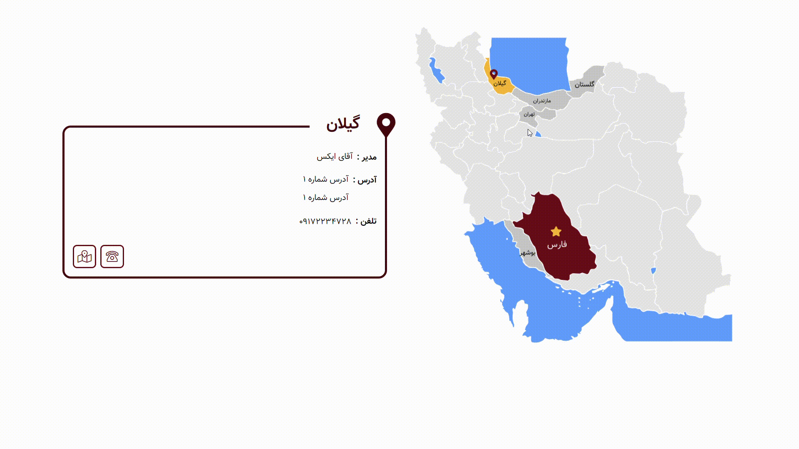

# iran-map-jquery
This map is made to display your favorite content based on each province.

[](https://www.npmjs.com/package/iran-map-jquery) [](https://standardjs.com)

<div align="center">
    
</div>

## Installation
You can install the project in one of the following ways:

### npm
```bash
npm install iran-map-jquery
```

### clone
```bash
https://github.com/hamed-shojaei/iran-map-jquery.git
```

## Usage
First, make sure you have **[jQuery](https://www.npmjs.com/package/jquery)** installed

```html
<!DOCTYPE html>  
<html>  
<head>  

 <link rel="stylesheet" href="./dist/scss/map.css"> <!-- OR scss --> 
 
</head>
<body>

<div id="IranMap" 
     data-province-active="Mazandaran,Golestan,Gilan,Bushehr,Tehran,Fars"
     data-province-center="Fars"
     data-province-show="Fars">
</div>
<ol id="IranMapList">
  <li class="Item" data-city="فارس - شیراز" data-province="Fars">
    ...
  </li>
  <li class="Item" data-city="تهران" data-province="Tehran">
    ...
  </li>
</ol>


<script src=".../jquery.min.js"></script>  
<script src="./dist/js/map.js"></script>
</body>
```

* #### **In Map**
  * **data-province-active :** provinces you want to be available.[List of provinces](#ProvincesList) 
  * **data-province-center :** select the province you want to be the main representative. 
  * **data-province-show :** the province you want to be active in the first.  
 
* #### **In List**
  * **data-city :** The show name of the province.
  * **data-province :** Name of the province based on the [List of provinces](#ProvincesList).
  
* ***[Note] :*** If you have multiple lists for a province, all **data-province** lists must be the same.

## ProvincesList
***[Note] :***  **data-province-active** ,**data-province-center** ,**data-province-show** ,**data-province** should be from this list and are case sensitive.

1. Bushehr
2. Khuzestan
3. Fars
4. Kerman
5. Sistan
6. Semnan
7. RazaviKhorasan
8. Golestan
9. NorthKhorasan
10. EastAzerbaijan
11. Ardabil
12. Gilan
13. Mazandaran
14. WestAzerbaijan
15. Qazvin
16. Alborz
17. Tehran
18. Isfahan
19. Yazd
20. SouthKhorasan
21. Zanjan
22. Chaharmahal
23. Kohgiluyeh
24. Kurdistan
25. Hormozgan
26. Kermanshah
27. Hamedan
28. Lorestan
29. Ilam
30. Markazi
31. Qom
 
## Style
* If you are using sass, customize the package by changing the **variable.scss** file.
* Otherwise, make a **copy** of the original style file and make the necessary changes.

## License

MIT © [hamedshojaei](https://github.com/hamed-shojaei)
